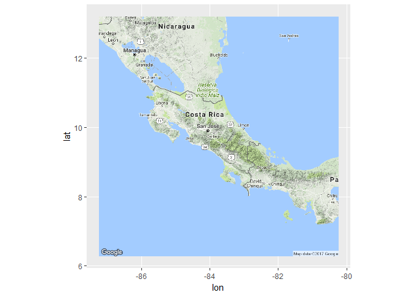

# Using google maps 
Fabio Fernandez  
November 20, 2017  


# How to Center a google map (center=Costa Rica)

```r
library(ggmap)

crcent <- as.numeric(geocode("Costa Rica"))
mapasalida <- ggmap(get_googlemap(center=crcent, scale=2, zoom=7), extent="normal")
mapasalida
```

<!-- -->

