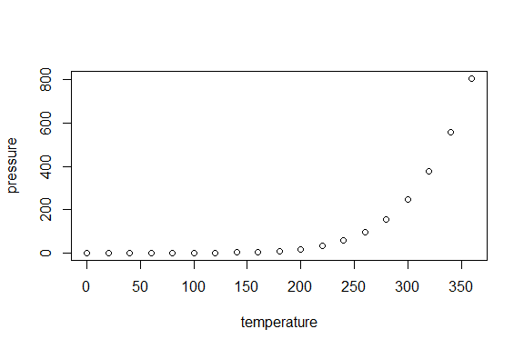
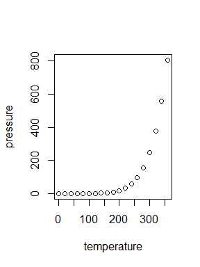
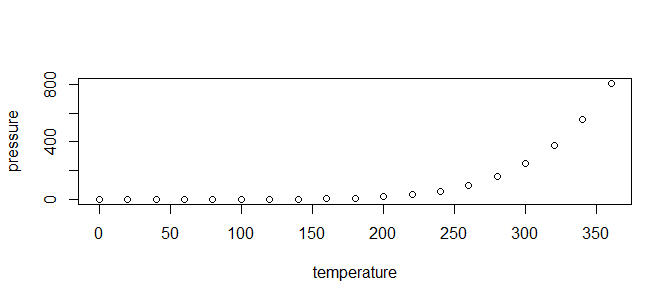

# Several ways to set figure size in R
Fabio Fernandez  
November 20, 2017  


# Let's use the known mtcars dataframe


```r
data(mtcars) 
names(mtcars) 
```

```
##  [1] "mpg"  "cyl"  "disp" "hp"   "drat" "wt"   "qsec" "vs"   "am"   "gear"
## [11] "carb"
```

## Option #1, YAML header

You can set the size of figures globally in the YAML part, example.


```r
--- 
title: "My Document" 
output: html_document: 
fig_width: 10 
fig_height: 8 
---
```

## Option #2, Define figure size as global chunk option
This will also affect all figures
  

```r
{r setup}
knitr::opts_chunk$set(fig.width=10, fig.height=8) 
...
```


## Option #3, Define figure size in the Chunk options

### Just change the height and width parameters

```r
{r fig1, fig.height = 4, fig.width = 6}
plot(pressure) 
```

<!-- -->

### The alignment can be also specified

```r
{r fig2, fig.height = 4, fig.width = 3, fig.align = "center"}
plot(pressure) 
```



### The aspect ratio can be used

```r
{r fig3,  fig.asp = .62}
plot(pressure) 
```

<!-- -->

